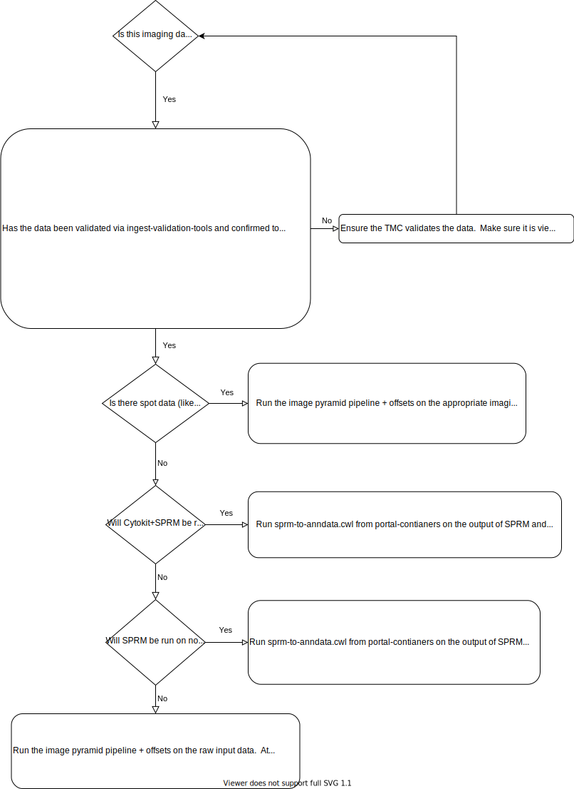

# portal-visualization

Given HuBMAP Dataset JSON (e.g. https://portal.hubmapconsortium.org/browse/dataset/004d4f157df4ba07356cd805131dfc04.json), creates a Vitessce configuration.

## Installation

This package provides two install modes to suit different use cases:

### Thin Install (Default)

For applications that only need to check if a dataset has visualization support without generating actual visualizations:

```bash
pip install portal-visualization
```

**Features:**

- Provides `has_visualization()` function to check visualization availability
- Minimal dependencies (pure Python, <1 MB install size)
- Fast installation and import times
- Ideal for services that need to filter/check datasets

**Example usage:**

```python
from portal_visualization import has_visualization

entity = {"uuid": "abc123", "vitessce-hints": ["is_image", "rna"]}
if has_visualization(entity, get_entity_fn):
    print("This dataset can be visualized")
```

### Full Install

For applications that need complete visualization generation capabilities:

```bash
pip install portal-visualization[full]
```

**Features:**

- Complete Vitessce configuration generation
- All visualization builders and dependencies (~150 MB install size)
- Required for portal-ui and search-api
- Includes vitessce, zarr, aiohttp, and other visualization libraries

**Example usage:**

```python
from portal_visualization.builder_factory import get_view_config_builder

builder = get_view_config_builder(entity, get_entity_fn)
conf_cells = builder.get_conf_cells(marker="CD45")
```

### Development Install

For contributors developing the package:

```bash
pip install portal-visualization[all]
# or
pip install -e ".[all]"  # for editable install
```

This installs both `[full]` and `[dev]` extras (testing, linting tools).

## Release process

This is a dependency of [portal-ui](https://github.com/hubmapconsortium/portal-ui/search?q=builder_factory) and [search-api](https://github.com/hubmapconsortium/search-api/search?q=builder_factory).

Updates that are more than housekeeping should result in a new release:

- bump `VERSION.txt`.
- make a new git tag: `V=$(cat VERSION.txt); git tag $V; git push origin $V`.
- make a release on github.
- **Test both install modes**: `pip install dist/portal_visualization-*.whl` (thin) and `pip install dist/portal_visualization-*.whl[full]` (full)
- in portal-ui, update `pyproject.toml` to use `portal-visualization[full]`.
- in search-api, update `requirements.txt` to use `portal-visualization`.

**Note:** Downstream projects which require complete visualization capabilities (e.g. `portal-ui`) should install with `[full]` extras to maintain complete visualization capabilities. Projects which only require the `has_visualization` function (e.g. `search_api`)

## Development Setup

This project uses modern Python tooling:

- **uv** for fast dependency management and packaging
- **ruff** for linting and formatting
- **pytest** for testing with 100% coverage requirement

### Installation

Install dependencies using uv:

```bash
# Install uv if not already installed
curl -LsSf https://astral.sh/uv/install.sh | sh

# For thin install testing (has_visualization only)
uv sync

# For full install testing (complete functionality)
uv sync --extra full

# For development (includes all extras)
uv sync --all-extras
```

Alternatively, use pip if desired:

```bash
# Thin install
pip install -e .

# Full install
pip install -e ".[full]"

# Development install
pip install -e ".[all]"
```

## CLI

Installing this package makes the `vis-preview` command available:

```bash
# Using uv
uv sync
uv run vis-preview --help

# Or with pip
pip install .
vis-preview --help
```

Usage:

```
usage: vis-preview [-h] (--url URL | --json JSON) [--assets_url URL]
                   [--token TOKEN] [--marker MARKER] [--to_json]
                   [--epic_uuid UUID] [--parent_uuid UUID]

Given HuBMAP Dataset JSON, generate a Vitessce viewconf, and load vitessce.io.

options:
  -h, --help          show this help message and exit
  --url URL           URL which returns Dataset JSON
  --json JSON         File containing Dataset JSON
  --assets_url URL    Assets endpoint; default:
                      https://assets.dev.hubmapconsortium.org
  --token TOKEN       Globus groups token; Only needed if data is not public
  --marker MARKER     Marker to highlight in visualization; Only used in some
                      visualizations.
  --to_json           Output viewconf, rather than open in browser.
  --epic_uuid UUID    uuid of the EPIC dataset.
  --parent_uuid UUID  Parent uuid - Only needed for an image-pyramid support
                      dataset.
```

Notes:

1. The token can be retrieved by looking for Authorization Bearer {token represented by a long string} under `search-api` network calls under the network tab in developer's tool when browsing a dataset in portal while logged in. The token is necessary to access non-public datasets, such as those in QA.
2. The documentation for the `vis-preview` command must match its `--help` output. When a command argument is added or modified, the README must be updated to match the output of `vis-preview --help`.

## Package Structure

The package follows modern Python packaging standards:

- **Entry point**: The CLI is installed as a console script entry point (`vis-preview`) that calls `portal_visualization.cli:main()`
- **Package data**: `defaults.json` is included as package data via `[tool.setuptools.package-data]`
- **Source layout**: All code is in `src/portal_visualization/` following the src-layout pattern
- **Distribution**: `MANIFEST.in` controls what files are included in source distributions

## Build & Testing

### Building

```bash
# Using uv (recommended)
uv build

# Or using standard Python build tools
python -m build
```

### Running Tests

The test suite supports both thin and full install modes:

```bash
# Run the full test suite (requires [full] extras)
./test.sh

# Run only thin install tests (no [full] extras needed)
uv run pytest -m "not requires_full"

# Run individual checks
uv run ruff check src/ test/          # Linting
uv run ruff format --check src/ test/ # Format checking
uv run ruff format src/ test/         # Auto-format code
uv run pytest -vv --doctest-modules   # Tests only
uv run coverage run -m pytest         # With coverage
```

**Test organization:**

- Tests marked with `@pytest.mark.requires_full` need the `[full]` install
- The `has_visualization` function and core logic can be tested without heavy dependencies
- CI should test both modes to ensure compatibility

All code must:

- Pass ruff linting and formatting checks
- Maintain 100% test coverage
- Pass all pytest tests including doctests

  ```

  ```

## Background



Data for the Vitessce visualization almost always comes via raw data that is processed by [ingest-pipeline](https://github.com/hubmapconsortium/ingest-pipeline) airflow dags.
Harvard often contributes our own custom pipelines to these dags that can be found in [portal-containers](https://github.com/hubmapconsortium/portal-containers).

The outputs of these pipelines are then converted into view configurations for Vitessce by the [portal backend](https://github.com/hubmapconsortium/portal-visualization/blob/main/src/portal_visualization/client.py), The `vis-preview.py` mimics the invocation of `get_view_config_builder` for development and testing purposes independently, i.e., without using the [portal backend](https://github.com/hubmapconsortium/portal-ui/blob/main/context/app/routes_browse.py#L126).

using code in this repo, when a `Dataset` that should be visualized is requested in the client.
The view configurations are built using the [Vitessce-Python API](https://vitessce.github.io/vitessce-python/).

### Imaging Data

HuBMAP receives various imaging modalities (microscopy and otherwise).
The processing is fairly uniform, and always includes running [ome-tiff-pyramid](https://github.com/hubmapconsortium/ome-tiff-pyramid) + a [pipeline](https://github.com/hubmapconsortium/portal-containers/tree/main/containers/ome-tiff-offsets) for extracting byte offsets to [optimize visualization](https://github.com/hms-dbmi/viv/tree/master/tutorial#viewing-in-avivator) load speeds of large imaging datasets.
Vitessce is able to view OME-TIFF files directly via [Viv](https://github.com/hms-dbmi/viv). Two pipelines are commonly used for processing the image data with a more analytic orientation:
[Cytokit](https://github.com/hubmapconsortium/codex-pipeline) is used to produce segmentations (+ stitching if the input data is tiled) for downstream analysis and [SPRM](https://github.com/hubmapconsortium/sprm) is one such analytic pipeline that does clustering and quantification.
Below are common questions and answers for imaging modalities:

<details><summary>Has the data been validated via ingest-validation-tools and confirmed to be viewable using Avivator (which loads data almost identically to what is in the portal)?</summary>

If so, we should ask the TMC to follow the instructions below for viewing their data in Avivator to make sure it looks right (should only need to be done for a single representative file): https://github.com/hms-dbmi/viv/tree/master/tutorial

In the above instructions they should only need to a) run the `bioformats2raw-raw2ometiff` pipeline and then b) drag-and-drop or select the input file using the "CHOOSE A FILE" button on avivator.gehlenborglab.org. There is no need for a web server.

If there is a z or t stack to the data, ensure that each "stack" is uploaded as a single file.

If it is valid in these three senses (viewable in Avivator locally, passes `ingest-validation-tools`, and "stacks" are uploaded as single files), then ingestion may be done and pipeline processing may proceed.

</details>

<details><summary>Is there "spot" data, such as resolved probe locations from a FISH assay that needs to be visualized as a Vitessce molecules data type?</summary>

If the answer is "yes," we should run the image pyramid pipeline + offsets on the appropriate imaging data. We currently do not have a pipeline for visualizing spot data.
Create a new class that inherits from ViewConfBuilder to visualize the data (raw imaging + spot data) when such a pipeline is created.
If there is segmentation data coming from the TMC or elsewhere, then that will need to be both processed (via [sprm-to-anndata.cwl from portal-containers](https://github.com/hubmapconsortium/portal-containers/tree/master/containers/sprm-to-anndata) or a different pipeline that ideally outputs zarr-backed AnnData) and visualized as well.

</details>

<details><summary>Will Cytokit + SPRM be run?</summary>

If the answer is "yes," we should run [sprm-to-anndata.cwl from portal-containers](https://github.com/hubmapconsortium/portal-containers/tree/master/containers/sprm-to-anndata) on the output of SPRM and the image pyramid pipeline + offsets on the output of Cytokit.
Extend [`StitchedCytokitSPRMViewConfBuilder`](https://github.com/hubmapconsortium/portal-visualization/blob/d9e924547d970f8469cf74881ce05cc22500b7fc/src/builders/sprm_builders.py#L287) to handle this assay.

</details>

<details><summary>Will only SPRM be run (on non-Cytokit Segmentations)?</summary>

If the answer is "yes," we should run [sprm-to-anndata.cwl from portal-containers](https://github.com/hubmapconsortium/portal-containers/tree/master/containers/sprm-to-anndata) from portal-containers on the output of SPRM and the image pyramid pipeline + offsets on the raw input data.
Create a new class that extends `MultiImageSPRMAnndataViewConfBuilder`, similar to [`StitchedCytokitSPRMViewConfBuilder`](https://github.com/hubmapconsortium/portal-visualization/blob/d9e924547d970f8469cf74881ce05cc22500b7fc/src/builders/sprm_builders.py#L287) if needed for multiple images in the same dataset.
Otherwise you may use [`SPRMAnnDataViewConfBuilder`](https://github.com/hubmapconsortium/portal-visualization/blob/d9e924547d970f8469cf74881ce05cc22500b7fc/src/builders/sprm_builders.py#L138) with the proper arguments.

</details>

<details><summary>For everything else...</summary>

Run the image pyramid pipeline + offsets on the raw input data.
Attach the assay to a new class in the portal backend similar to [`SeqFISHViewConfBuilder`](https://github.com/hubmapconsortium/portal-visualization/blob/d9e924547d970f8469cf74881ce05cc22500b7fc/src/builders/imaging_builders.py#L113) or [`ImagePyramidViewConfBuilder`](https://github.com/hubmapconsortium/portal-visualization/blob/d9e924547d970f8469cf74881ce05cc22500b7fc/src/builders/imaging_builders.py#L58).
This will depend on how you want the layout to look to the end user.

</details>

### Sequencing Data

#### xxxx-RNA-seq

Currently, `RNA-seq` data comes as `AnnData` `h5ad` files from [Matt's pipeline](https://github.com/hubmapconsortium/salmon-rnaseq). Vitessce is able to view `AnnData` directly when saved as `zarr`. In order to visualize the data, the following steps must be taken to alter the the incoming `AnnData` `h5ad` file:

1. Chunked correctly for optimal viewing
2. Marker genes located in the `obs` part of the store (so they may be visualized as pop-overs when hovered)
3. A filter for a subset of genes (corresponding to the marker genes) is stored so that it may be rendered as a heatmap.
4. Save this altered dataset as a `.zarr` store.

These steps are exexuted by the [`anndata-to-ui`](https://github.com/hubmapconsortium/portal-containers/blob/dc568234c76017c7cd9644a4d15ef0f7b9d84e24/containers/anndata-to-ui/context/main.py#L17-L67) container that is run after Matt's pipeline; The view config is generated by [`RNASeqAnnDataZarrViewConfBuilder`](https://github.com/hubmapconsortium/portal-visualization/blob/d9e924547d970f8469cf74881ce05cc22500b7fc/src/builders/anndata_builders.py#L13).
Currently the portal backend cannot handle `slide-seq`, which is a spatially resolved `RNA-seq` assay, but its `ViewConfBuilder` class will look be the same as `RNASeqAnnDataZarrViewConfBuilder`, except for an additional `spatial_polygon_obsm="X_spatial"` argument to the `AnnDataWrapper` as well as a `SPATIAL` vitessce component in the view config.

#### xxxx-ATAC-seq

Currently only the (mis-named) [h5ad-to-arrow](https://github.com/hubmapconsortium/portal-containers/tree/master/containers/h5ad-to-arrow) pipeline is used to convert `h5ad` `AnnData` files to `json` that contains only the scatterplot results of the scanpy analysis.
In the future, [`vitessce-python`](https://github.com/vitessce/vitessce-python/blob/c7edf9c0057fb1e5fc53e957c0657e61b0e43b90/vitessce/wrappers.py#L543) (or something similar) should be used as a new container to process the `SnapATAC`-backed (or other method of storage) peaks for visualization in Vitessce as [genomic profiles](http://beta.vitessce.io/docs/data-file-types/index.html#genomic-profileszarr).
See [here](http://beta.vitessce.io/index.html?dataset=sn-atac-seq-hubmap-2020) for a demo what the final result will look like.

#### SNARE-seq

`SNARE-seq` is a mix of the above two modalities and its processing and visualization is still TBD.
